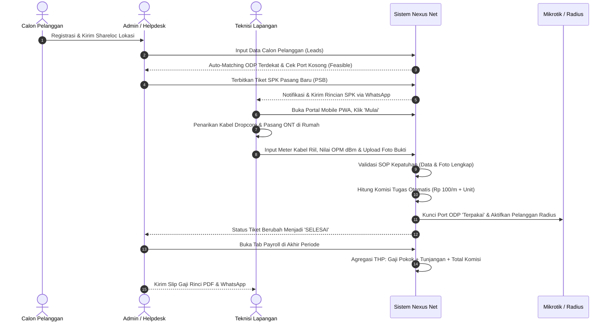

# DOKUMEN EKSEKUTIF: PEMBAHASAN FITUR, NILAI BISNIS, DAN ALUR KERJA
## NEXUS NET MANAGEMENT — ALL-IN-ONE FTTH ISP OPERATIONS PLATFORM

---

## 1. EXECUTIVE SUMMARY & LATAR BELAKANG PRODUK

### 1.1 Visi Produk
**Nexus Net Management** adalah platform terintegrasi generasi baru yang dirancang khusus untuk operator penyedia jasa internet (ISP) berbasis kabel fiber optik (*Fiber-To-The-Home / FTTH*). Sistem ini mengintegrasikan seluruh rantai operasional—mulai dari autentikasi peran, akuisisi calon pelanggan, pemetaan topologi jaringan kabel optik (GIS Digital Twin), penerbitan Surat Perintah Kerja (SPK), aplikasi mobile teknisi di lapangan, validasi kualitas optik (OPM), hingga administrasi penagihan dan slip gaji komisi teknisi dalam **satu ekosistem tertutup (Closed-Loop Automation)**.

*Gambar 1.0: Pintu masuk terproteksi dengan Role-Based Access Control (Admin, Dispatcher NOC, Teknisi Lapangan) serta tombol pintas Demo Switcher.*

### 1.2 Masalah Klasik Operasional ISP (Pain Points)
Sebelum implementasi Nexus Net, perusahaan ISP umumnya menghadapi 4 inefisiensi operasional kritis:
1. **Kebocoran Port ODP (Overcapacity & Ghost Ports)**: Data port tiang pada lembar Excel kantor sering berbeda dengan kondisi fisik colokan di tiang lapangan. Port penuh tanpa izin atau port kosong yang tercatat penuh, menyebabkan hilangnya potensi penjualan.
2. **Tingginya Komplain Redaman Drop**: Teknisi di lapangan sering terburu-buru melakukan serah terima tanpa bukti hasil ukur redaman OPM (*Optical Power Meter*), sehingga modem pelanggan sering mengalami gangguan *LOS (Loss of Signal)* atau internet lambat.
3. **Pekerjaan Ganda & Rekap Manual (Double Entry)**: Admin kantor harus memindahkan laporan serah terima dari pesan WhatsApp teknisi ke sistem billing/Radius secara manual setiap malam.
4. **Perselisihan Komisi Teknisi**: Tidak adanya transparansi perhitungan meteran kabel dropcore dan unit kerja fisik yang dipasang menimbulkan kecurigaan dan ketidakpuasan antar regu teknisi.

### 1.3 Solusi Terobosan Nexus Net
Nexus Net mengeliminasi seluruh inefisiensi tersebut melalui otomatisasi: **sekali teknisi menyelesaikan pekerjaan dengan bukti autentik di lapangan, port tiang terkunci, pelanggan aktif di billing, dan komisi terhitung otomatis.**

---

## 2. PEMBAHASAN MENDALAM PER FITUR DENGAN DOKUMENTASI VISUAL

---

### MODUL 1: DASHBOARD EKSEKUTIF & REAL-TIME INTELLIGENCE
Pusat visibilitas helikopter (*cockpit view*) yang memberikan gambaran menyeluruh performa teknis dan finansial ISP secara *real-time*.

*Gambar 2.1: Tampilan Dashboard Eksekutif menampilkan status koneksi Supabase real-time, ringkasan KPI port kota, dan beban kerja regu teknisi.*

- **Poin-Poin Penting**:
  - **Live Webhook & Database Synchronizer**: Dilengkapi badge indikator status aktif Supabase yang berdenyut hijau, menandakan seluruh perubahan data lapangan tersinkronisasi dalam hitungan milidetik tanpa perlu *refresh* browser.
  - **Kartu Ringkasan KPI Finansial & Operasional**: Menampilkan jumlah total pelanggan aktif, rasio utilisasi port ODP kota (contoh: 74% terpakai), estimasi pendapatan bulanan (MRR), dan status tiket gangguan aktif.
  - **Beban Kerja Tim Teknisi Real-Time**: Visualisasi beban tugas masing-masing regu teknisi (Siaga di Kantor, Sedang di Jalan, atau Sedang Mengerjakan di Tiang) guna mencegah kelebihan beban kerja (*burnout*) pada satu tim.
  - **Statistik & Tren Kinerja**: Grafik interaktif volume penyelesaian pekerjaan harian dan tren tingkat kepatuhan SLA.

---

### MODUL 2: GIS TOPOLOGI FTTH & DIGITAL TWIN (GOOGLE EARTH ENGINE)
Peta pemetaan aset jaringan fisik berbasis citra satelit Google Earth beresolusi tinggi, memvisualisasikan seluruh jaringan kabel optik dari pusat NOC hingga rumah pelanggan.

*Gambar 2.2: Peta topologi optik interaktif dengan denyut laser sinyal 60 FPS menyusuri kabel feeder, distribusi, dan tiang ODP.*

- **Poin-Poin Penting**:
  - **Hierarki Kabel Optik 3 Lapis**:
    1. 🟠 **Kabel Feeder (Backbone)**: Jalur kabel utama berkapasitas besar dari OLT Server NOC menuju boks ODC (garis emas berdenyut cepat).
    2. 🟢 **Kabel Distribusi**: Jalur kabel distribusi tiang jalan raya dari ODC menuju boks ODP di gang/lingkungan perumahan (garis hijau neon).
    3. 🟣 **Kabel Dropcore Pelanggan**: Kabel 1-core dari tiang ODP ke modem ONT di rumah pelanggan (garis ungu).
  - **Animasi Aliran Sinyal Laser 60 FPS**: Visualisasi arah pancaran cahaya optik dengan akselerasi GPU, mempermudah identifikasi titik putus atau arah distribusi sinyal.
  - **Spotlight Path Tracing**: Klik salah satu rumah pelanggan atau ODP mana pun di peta, sistem seketika menyorot silsilah kabel ke belakang sampai ke OLT NOC pusat beserta rincian splitter dan estimasi redaman dBm.
  - **Inspeksi Kapasitas Port Tiang Interaktif**: Cukup klik ikon tiang ODP untuk melihat kapasitas port (contoh: 6/8 terpakai), nomor port yang masih kosong, dan daftar nama pelanggan yang tertancap pada tiang tersebut.

---

### MODUL 3: AKUISISI LEADS & SIMULASI FEASIBILITY SURVEY 3D
Modul otomatisasi kelayakan teknis bagi calon pelanggan baru sebelum tim teknisi diberangkatkan ke lokasi.

*Gambar 2.3: Analisis kelayakan calon pelanggan otomatis dengan penentuan tiang ODP terdekat dan estimasi panjang kabel dropcore.*

- **Poin-Poin Penting**:
  - **Input Shareloc Koordinat Google Maps**: Cukup masukkan link koordinat dari chat WhatsApp calon pelanggan.
  - **Pencocokan ODP Otomatis (Auto ODP Matching)**: Sistem secara cerdas memindai seluruh tiang dalam radius jangkauan, mencari ODP terdekat yang **memiliki port kosong**.
  - **Kalkulator Jarak & Estimasi Redaman Otomatis**: Menghitung panjang kabel dropcore yang dibutuhkan (dalam meter) serta estimasi nilai redaman optik (dBm) yang akan diterima modem.
  - **Status Kelayakan Instan (*Feasible vs Unfeasible*)**: Jika jarak kabel melebihi batas standar (misal > 250 meter) atau seluruh ODP di sekitar penuh, sistem memberikan status peringatan kelayakan.
  - **Konversi 1-Klik Menjadi SPK**: Calon pelanggan yang layak dapat langsung diubah menjadi tiket penugasan pemasangan tanpa admin mengetik ulang nama, alamat, atau nomor telepon.

---

### MODUL 4: MANAJEMEN PEKERJAAN & SPK WHATSAPP DISPATCHER
Papan kendali penugasan teknisi (*Work Order Management*) yang menghubungkan kantor dispatcher dengan regu lapangan.

*Gambar 2.4: Pipeline Kanban penugasan terstruktur dari Waiting List, Dijadwalkan, hingga Selesai dengan generator SPK WhatsApp.*

- **Poin-Poin Penting**:
  - **4 Jenis Pekerjaan Resmi**:
    1. **Pemasangan Baru (PSB)**: Penarikan dropcore, pemasangan modem ONT, dan terminasi port ODP (SLA 24 Jam).
    2. **Perbaikan Gangguan (Troubleshoot)**: Penanganan redaman drop, kabel putus / LOS, atau adaptor rusak (SLA 6 Jam).
    3. **Perbaikan Khusus Distribusi (ODP/ODC)**: Penggantian boks tiang, perapian kabel, penggantian splitter (SLA 4 Jam).
    4. **Pemutusan (Dismantle)**: Pencabutan kabel dropcore dan penarikan perangkat modem pelanggan non-aktif (SLA 48 Jam).
  - **Penomoran Standar SPK Resmi**: Sistem menghasilkan kode SPK terstruktur (contoh: `SPK/PSB/202610/0042`) lengkap dengan sesi kerja (Pagi, Siang, Sore) dan tingkat prioritas (Normal, Tinggi, 🚨 Darurat LOS).
  - **Deteksi Bentrok Jadwal (Collision Prevention)**: Peringatan otomatis jika dispatcher menugaskan teknisi yang sudah memiliki jadwal kerja lain pada jam yang sama.
  - **1-Klik Kirim SPK ke WhatsApp Teknisi**: Tombol terintegrasi yang menyusun pesan WhatsApp terformat rapi ke nomor teknisi, lengkap dengan rincian pelanggan, alamat, titik ODP target, dan tautan Google Maps.

---

### MODUL 5: MOBILE PWA FIELD PORTAL (APLIKASI MOBILE TEKNISI)
Aplikasi berbasis *Progressive Web App (PWA)* yang dapat diakses langsung oleh teknisi melalui browser smartphone (Chrome/Safari) tanpa perlu mengunduh dari Play Store / App Store.

*Gambar 2.5: Antarmuka mobile teknisi di lapangan dilengkapi barometer OPM, checklist SOP keselamatan, kalkulasi meter kabel, dan upload foto.*

- **Poin-Poin Penting**:
  - **Desain Khusus Lapangan (Mobile-First UI)**: Tombol besar dan kontras tinggi, navigasi 1-tap ke Google Maps arah rumah pelanggan, dan tombol langsung WhatsApp/Telepon pelanggan.
  - **Barometer Redaman Optik (Optical Power Gauge)**: Visual meter dinamis untuk menguji redaman OPM (-dBm) dengan kode warna standar ISP:
    - 🟢 **Prima**: `-15.0 s.d -21.9 dBm`
    - 🟡 **Waspada**: `-22.0 s.d -23.9 dBm`
    - 🔴 **Kritis / Buruk**: `> -24.0 dBm` atau `< -14.0 dBm`
  - **Validasi Wajib Mutlak Kepatuhan SOP (Mandatory Completion SOP)**:
    - Teknisi **tidak bisa** menyelesaikan tugas tanpa mengisi angka ukur OPM yang valid.
    - Nomor seri (SN/MAC) modem ONT wajib diisi untuk pemasangan baru.
    - **Wajib melampirkan minimal foto bukti fisik** (Foto layar OPM dan Foto unit modem menyala normal).
  - **Input Meteran Kabel Riil**: Teknisi memasukkan panjang meter kabel dropcore yang ditarik di lapangan untuk menentukan nilai komisi riil tugas secara adil dan transparan.
  - **Ketahanan Luar Jaringan (Offline Sync Queue)**: Saat teknisi berada di area tanpa sinyal seluler, laporan pekerjaan tetap tersimpan di penyimpanan lokal HP dan otomatis terkirim saat sinyal kembali normal.

---

### MODUL 6: OTOMASI TERTUTUP (CLOSED-LOOP RADIUS & PORT SYNC)
Fitur unggulan yang menghubungkan hasil pengerjaan fisik di lapangan dengan sistem database pusat dan MikroTik billing secara instan.

*Gambar 2.6: Daftar pelanggan aktif tersinkronisasi otomatis dengan port tiang ODP dan profil paket internet MikroTik PPPoE.*

- **Poin-Poin Penting**:
  - **Aktivasi Port ODP Seketika**: Begitu teknisi menekan tombol simpan laporan selesai, nomor port ODP yang ditancapkan otomatis berubah status dari *Tersedia* menjadi *Terpakai*.
  - **Sinkronisasi Pelanggan Radius**: Data pelanggan otomatis berpindah ke daftar pelanggan aktif dengan status terverifikasi, nomor seri ONT tercatat, dan tanggal pemasangan terarsip.
  - **Otomatisasi Pelepasan Port pada Pemutusan (Dismantle)**: Saat pekerjaan pemutusan diselesaikan, port tiang ODP seketika dibebaskan kembali menjadi *Tersedia* untuk dijual ke pelanggan baru berikutnya.
  - **Zero Human Error**: Mengeliminasi 100% kesalahan lupa mencatat atau dobel input port tiang.

---

### MODUL 7 & 8: SISTEM KOMISI RESMI & MANAJEMEN PAYROLL TEKNISI
Mesin kalkulasi penggajian dan insentif kerja transparan berdasarkan **Tabel Resmi Komisi Pekerjaan Team Nexus**.

*Gambar 2.7: Rekapitulasi Take Home Pay, rincian komisi per tugas, cetak slip gaji PDF, dan integrasi pengiriman slip via WhatsApp.*

- **Poin-Poin Penting**:
  - **12 Item Komisi Pekerjaan Fisik Resmi**:
    1. Tarik Kabel Pelanggan Baru + Fastcont: **Rp 100 / Meter**
    2. Pemasangan Modem ke Pelanggan: **Rp 5.000 / Unit**
    3. Setting Modem Pelanggan (PPPoE & WiFi): **Rp 3.000 / User**
    4. Tarik Kabel ODP/ODC + Fastcont: **Rp 200 / Meter**
    5. Rakit ODP/ODC: **Rp 7.500 / Unit**
    6. Pasang Boks ODP ke Tiang: **Rp 5.000 / Unit**
    7. Penarikan Ulang Kabel Rusak: **Rp 200 / Meter**
    8. Sambung Kabel Core Fiber (Splicing): **Rp 5.000 / Titik**
    9. Perbaikan Fast Connector: **Rp 3.500 / Titik**
    10. Perbaikan Modem / Adaptor: **Rp 3.000 / Unit**
    11. Perbaikan Menyeluruh ODP/ODC: **Rp 10.000 / Unit**
    12. Pemutusan / Dismantle Perangkat: **Rp 5.000 / Unit**
  - **3 Pilihan Skema Gaji Fleksibel**:
    - **Karyawan Tetap (`TETAP_KOMISI`)**: Gaji Pokok Bulanan + Tunjangan Makan & Transport + Total Komisi Tugas + Bonus Target Bulanan.
    - **Mitra Lepas (`KOMISI_MURNI`)**: 100% pendapatan berbasis komisi tugas fisik yang diselesaikan.
    - **Kontrak Harian (`HARIAN_KOMISI`)**: Uang Kehadiran Harian × Jumlah Hari Masuk + Total Komisi Tugas.
  - **Penerbitan Slip Gaji & Forward WhatsApp 1-Klik**:
    - Format resmi siap cetak / unduh PDF lengkap dengan rincian meter kabel dan pemotongan (BPJS/Kasbon).
    - Tombol otomatis mengirim rincian slip gaji resmi langsung ke WhatsApp pribadi teknisi.

---

## 3. ALUR KERJA OPERASIONAL LENGKAP (END-TO-END WORKFLOW)

---

## 4. POIN-POIN PENTING & NILAI JUAL BISNIS (KEY BUSINESS VALUES)

### 📈 1. Penghematan Waktu & Biaya Administrasi Hingga 60%
- Mengeliminasi proses administrasi rekap harian secara manual.
- Mengurangi waktu tunggu proses aktivasi pelanggan dari 24 jam menjadi instan saat teknisi selesai di lokasi.

### 🛡️ 2. Zero-Defect Kualitas Redaman Optik (SOP QC Enforcement)
- Validasi wajib mutlak mewajibkan teknisi menyertakan angka redaman OPM dan foto fisik sebelum tiket ditutup.
- Menurunkan angka komplain gangguan pasca-pemasangan hingga 90%.

### 🎯 3. Transparansi & Loyalitas Tim Teknisi Lapangan
- Setiap meter kabel yang ditarik teknisi tercatat dan terbayar secara adil.
- Teknisi dapat memantau akumulasi komisi di dompet digital mereka setiap saat secara mandiri.

### 🔌 4. Pengendalian Penuh Kapasitas Jaringan (Anti Ghost Port)
- Mencegah teknisi sembarangan mencolok kabel ke port tiang yang belum dialokasikan.
- Memberikan visibilitas 100% akurat antara data di peta dengan kabel fisik di tiang.

---

## 5. PANDUAN RINGKAS MENJAWAB PERTANYAAN DIREKSI (Q&A CHEAT SHEET)

1. **"Bagaimana jika aplikasi ini digunakan di area tanpa sinyal seluler?"**
   > *Sistem menggunakan teknologi PWA Service Worker dengan antrean sinkronisasi lokal. Teknisi tetap bisa mengisi data dan mengambil foto saat offline. Data otomatis terunggah saat perangkat kembali menangkap sinyal.*

2. **"Apakah tarif komisi per item bisa disesuaikan dengan aturan internal ISP kami?"**
   > *Bisa dan sangat mudah. Terdapat modul Master Komisi di mana manajemen dapat mengubah tarif per meter kabel, bonus unit, tunjangan, maupun potongan kapan saja.*

3. **"Apakah sistem ini aman dari pemalsuan foto oleh teknisi?"**
   > *Sistem menerapkan validasi SOP ketat yang mengombinasikan nilai ukur redaman, nomor seri ONT, dan foto bukti fisik yang dapat diaudit langsung oleh tim Quality Control.*

---

*Dokumen disusun resmi untuk tim operasional & presenter Nexus Net Management.*
