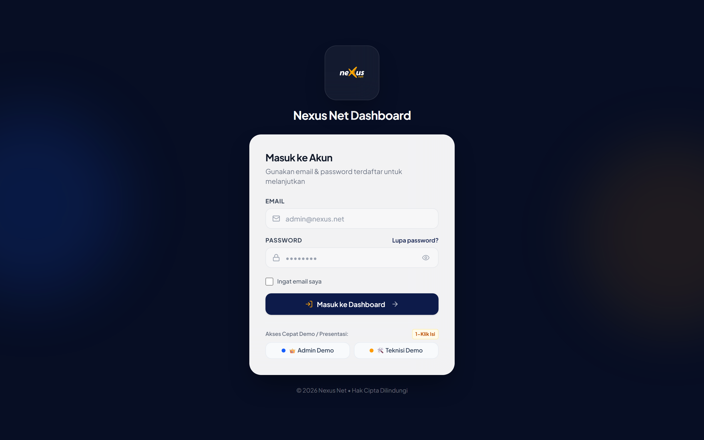
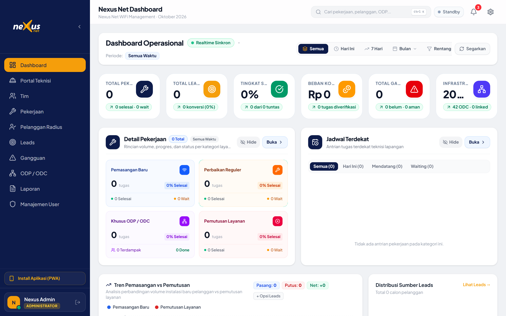
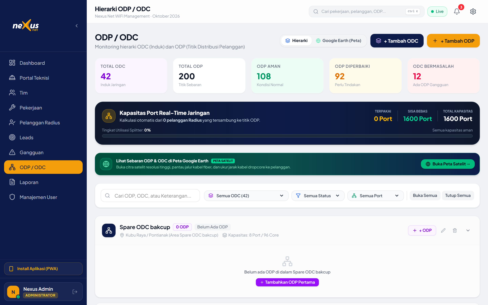
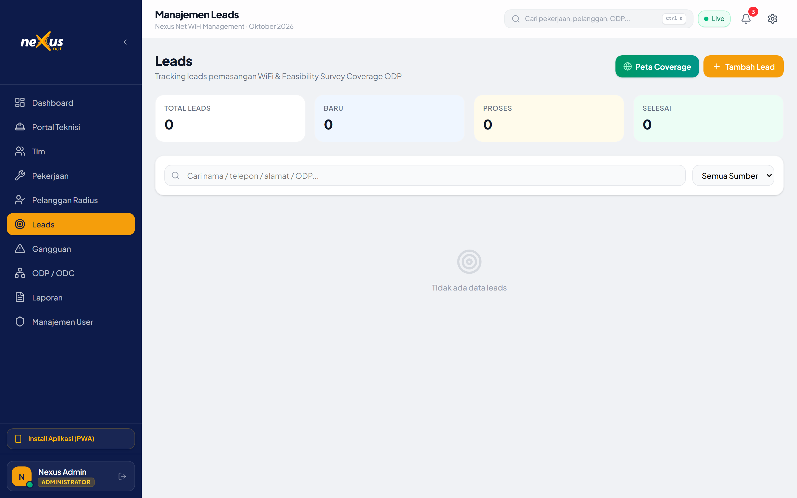
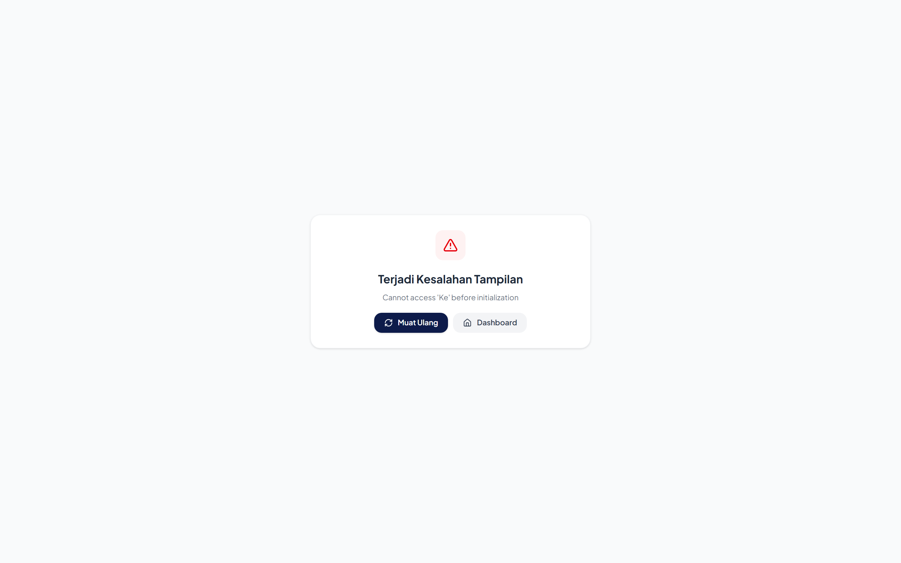
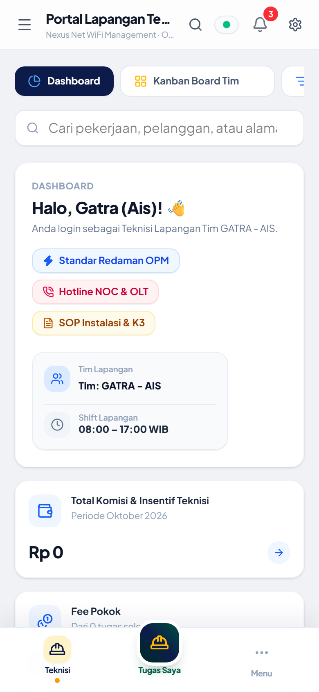
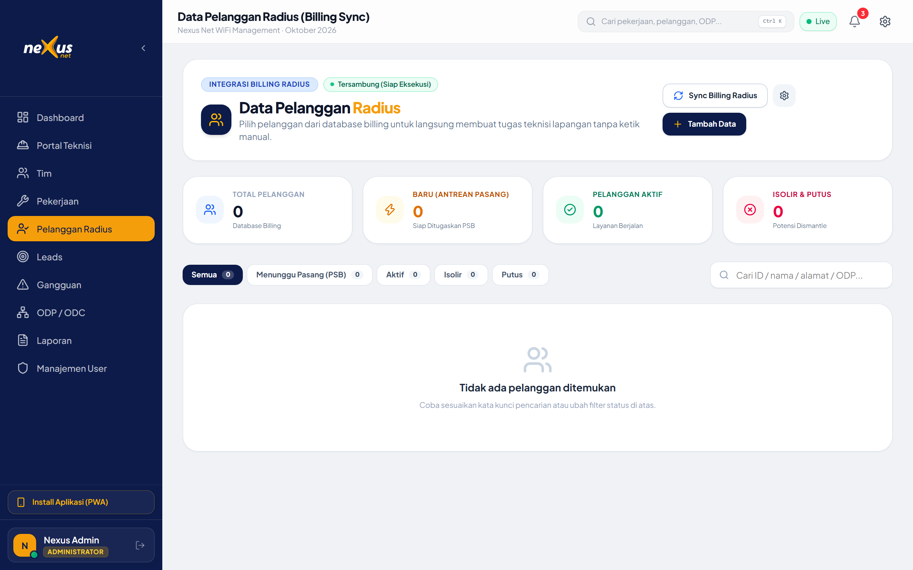
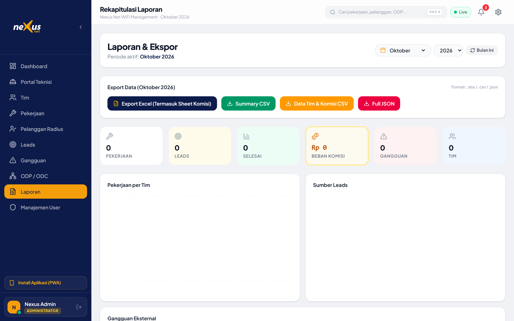

# Buku Panduan Lengkap Fitur & Skrip Presentasi Nexus Net

Dokumen ini merupakan panduan komprehensif bagi presenter untuk membedah seluruh modul aplikasi **Nexus Net**, dilengkapi anotasi hasil tangkapan layar asli (*high-resolution screenshots*), aturan bisnis (*business rules*), dan panduan narasi di depan dewan direksi, calon investor, maupun tim lapangan.

---

## Daftar Isi
1. [Arsitektur & Nilai Inti Produk](#1-arsitektur--nilai-inti-produk)
2. [Pusat Tangkapan Layar & Anotasi Fitur](#2-pusat-tangkapan-layar--anotasi-fitur)
   - [2.1 Halaman Login & Multi-Role RBAC](#21-halaman-login--multi-role-rbac)
   - [2.2 Dashboard Eksekutif & Real-Time Sync](#22-dashboard-eksekutif--real-time-sync)
   - [2.3 GIS Topologi FTTH Google Earth (Animasi Laser Sinyal)](#23-gis-topologi-ftth-google-earth-animasi-laser-sinyal)
   - [2.4 Manajemen Leads & Feasibility Survey 3D](#24-manajemen-leads--feasibility-survey-3d)
   - [2.5 Kanban Pekerjaan & Dispatching SPK WhatsApp](#25-kanban-pekerjaan--dispatching-spk-whatsapp)
   - [2.6 Portal Lapangan PWA Mobile Teknisi (OPM Barometer & K3)](#26-portal-lapangan-pwa-mobile-teknisi-opm-barometer--k3)
   - [2.7 Sinkronisasi Data Pelanggan Radius (Mikrotik PPPoE Sync)](#27-sinkronisasi-data-pelanggan-radius-mikrotik-pppoe-sync)
   - [2.8 Laporan Kinerja & Payroll Komisi Teknisi](#28-laporan-kinerja--payroll-komisi-teknisi)
3. [Alur Closed-Loop Otomasi (The Magic Flow)](#3-alur-closed-loop-otomasi-the-magic-flow)
4. [Skrip Narasi Presenter (Word-by-Word Pitching Guide)](#4-skrip-narasi-presenter-word-by-word-pitching-guide)
5. [Antisipasi Pertanyaan Kritis & Sesi Q&A (Objection Handling)](#5-antisipasi-pertanyaan-kritis--sesi-qa-objection-handling)

---

## 1. Arsitektur & Nilai Inti Produk

### 🎯 Masalah yang Diselesaikan:
Sebelum ada Nexus Net, operasional penyedia jasa internet (ISP) berbasis fiber optik kerap menghadapi 4 penyakit kronis:
1. **Port ODP Liar / Overcapacity**: Data port tiang di lembar Excel tidak sesuai dengan colokan fisik di tiang.
2. **Tingginya Komplain Redaman Drop**: Teknisi buru-buru serah terima tanpa bukti pengukuran optik (OPM), mengakibatkan internet pelanggan putus-nyambung.
3. **Pencatatan Ganda (Double Entry)**: Admin harus menginput ulang data dari chat grup WhatsApp teknisi ke sistem billing Mikrotik di malam hari.
4. **Ketidaktransparanan Komisi**: Perhitungan insentif pasang baru dan perbaikan gangguan sering menimbulkan perselisihan antar regu lapangan.

### 💡 Solusi Nexus Net:
Nexus Net menyatukan **GIS Jaringan Optik**, **Dispatching WhatsApp**, **Mobile App Teknisi PWA**, dan **Mikrotik Radius Billing** ke dalam **satu ekosistem tertutup (Closed-Loop Automation)**.

---

## 2. Pusat Tangkapan Layar & Anotasi Fitur

### 2.1 Halaman Login & Multi-Role RBAC


- **Fungsi Utama**: Pintu gerbang autentikasi terproteksi dengan pemisahan hak akses berbasis peran (Admin, Dispatcher NOC, Teknisi Lapangan).
- **Fitur Kunci**:
  - **1-Klik Quick Fill Demo**: Tombol pintas `👑 Admin Demo` dan `🛠️ Teknisi Demo` untuk demonstrasi instan tanpa salah ketik password.
  - **Graceful Offline Fallback**: Sesi demo otomatis tetap aktif walau server autentikasi atau internet presentasi mengalami gangguan.
  - **Ingat Saya (Local Credential Cache)**: Mengamankan identitas sesi tanpa mengorbankan privasi pengguna.

---

### 2.2 Dashboard Eksekutif & Real-Time Sync


- **Fungsi Utama**: Pusat visibilitas helikopter untuk pimpinan dan kepala operasional cabang.
- **Fitur Kunci**:
  - **Badge Real-Time Status**: Indikator koneksi websocket Supabase (hijau berdenyut) yang memastikan data selalu sinkron seketika.
  - **Kartu Ringkasan KPI**: Menampilkan total pelanggan aktif, rasio utilisasi port ODP keseluruhan, status tiket gangguan harian, dan tren pendapatan.
  - **Beban Kerja Tim Aktif**: Memantau regu teknisi yang sedang *standby* di kantor vs yang sedang dalam perjalanan atau mengerjakan SPK di tiang pelanggan.

---

### 2.3 GIS Topologi FTTH Google Earth (Animasi Laser Sinyal)


- **Fungsi Utama**: *Digital Twin* jaringan kabel optik berbasis citra satelit Google Earth beresolusi tinggi.
- **Fitur Kunci**:
  - **Animasi Denyut Laser Optik (60 FPS GPU-Accelerated)**:
    - 🟠 **Kabel Feeder**: Garis tebal emas berdenyut cepat (Backbone OLT ➔ ODC).
    - 🟢 **Kabel Distribusi**: Garis hijau menyusuri tiang gang (ODC ➔ ODP).
    - 🟣 **Kabel Dropcore**: Garis ungu neon putus-putus ke rumah pelanggan (ODP ➔ Modem ONT).
  - **End-to-End Spotlight Path Tracing**: Klik rumah atau ODP mana saja di peta, sistem seketika menyorot garis silsilah jaringan ke belakang sampai ke OLT NOC pusat beserta diagram alir dan estimasi redaman dBm.
  - **Inspeksi Port Tiang ODP**: Klik marker tiang untuk melihat kapasitas port (contoh: 6/8 terpakai), sisa port kosong, dan daftar nama pelanggan yang terhubung.

---

### 2.4 Manajemen Leads & Feasibility Survey 3D


- **Fungsi Utama**: Akuisisi pelanggan baru dan otomatisasi analisis kelayakan teknis sebelum penarikan kabel.
- **Fitur Kunci**:
  - **Input Shareloc Koordinat Google Maps**: Cukup masukkan link koordinat dari WhatsApp calon pelanggan.
  - **Auto ODP Matching & Distance Meter**: Sistem otomatis mencari ODP berport kosong terdekat dan menghitung jarak bentangan dropcore (meter).
  - **Estimasi Redaman Optik (Optical Budget)**: Kalkulasi matematis redaman yang akan diterima modem (dBm).
  - **1-Klik Konversi SPK**: Jika survey berstatus *FEASIBLE*, admin langsung dapat menerbitkan SPK pasang baru tanpa input ulang.

---

### 2.5 Kanban Pekerjaan & Dispatching SPK WhatsApp


- **Fungsi Utama**: Papan kendali tugas lapangan real-time dengan integrasi pesan instan WhatsApp.
- **Fitur Kunci**:
  - **Pipeline Kanban Responsif**: Membagi status pekerjaan (*Menunggu Dispatch*, *Ditugaskan*, *Sedang Dikerjakan*, *Selesai*).
  - **Anti-Collision Dispatch Warning**: Sistem memperingatkan dispatcher jika teknisi yang dipilih telah memiliki tugas aktif di jam yang sama.
  - **Generator Pesan WhatsApp 1-Klik**: Menghasilkan pesan rapi berisi Nomor SPK, Nama Pelanggan, No WhatsApp, Paket, Koordinat Google Maps, dan ID ODP target.

---

### 2.6 Portal Lapangan PWA Mobile Teknisi (OPM Barometer & K3)


- **Fungsi Utama**: Antarmuka khusus ponsel pintar yang ringan dan ramah jempol bagi teknisi saat memanjat tiang atau berada di rumah pelanggan.
- **Fitur Kunci**:
  - **Checklist K3 Mandatori**: Teknisi diwajibkan mencentang pemakaian helm pengaman, rompi, dan sabuk tiang sebelum memulai pekerjaan.
  - **Barometer OPM Redaman Interaktif**: Speedometer dinamis yang memberi feedback visual:
    - 🟢 Hijau (&le; -22 dBm): Sinyal Optimal.
    - 🟡 Kuning (-22 s/d -24 dBm): Standar Normal.
    - 🔴 Merah (&gt; -24 dBm): Redaman Buruk (Sistem menganjurkan *splicing* ulang).
  - **Watermark Geotag Kamera Otomatis**: Hasil jepretan foto langsung dicap permanen dengan titik koordinat GPS, tanggal & jam WIB, ID Pelanggan, dan nama tim.
  - **Offline Resilience Queue**: Jika teknisi berada di gang atau desa tanpa sinyal internet, laporan tersimpan di antrean lokal HP dan otomatis terkirim saat sinyal kembali ada.

---

### 2.7 Sinkronisasi Data Pelanggan Radius (Mikrotik PPPoE Sync)


- **Fungsi Utama**: Manajemen master data pelanggan yang tersinkronisasi langsung dengan server BRAS / Mikrotik Radius.
- **Fitur Kunci**:
  - **PPPoE Auto Provisioning**: Akun dibuat otomatis dengan username & password aman begitu teknisi menyelesaikan pasang baru.
  - **Sinkronisasi Port ODP**: Mengunci port ODP yang terpakai sehingga tidak terjadi perebutan port antar teknisi.
  - **Pencarian Cepat & Filter Status**: Filter instan berdasarkan status (Aktif, Isolir, Gangguan) dan wilayah ODC/ODP.

---

### 2.8 Laporan Kinerja & Payroll Komisi Teknisi


- **Fungsi Utama**: Transparansi finansial dan penggajian berbasis pencapaian fisik di lapangan.
- **Fitur Kunci**:
  - **Kalkulasi Komisi Instan**: Menghitung otomatis insentif per titik (Pasang Baru, Perbaikan Gangguan, dsb).
  - **Leaderboard Kinerja Tim**: Menilai performa kecepatan penanganan dan kepatuhan SOP redaman tiap regu teknisi.
  - **Export ke Excel (XLSX)**: Mengunduh rekapitulasi data siap cetak untuk bagian finance atau HRD dengan satu klik.

---

## 3. Alur Closed-Loop Otomasi (The Magic Flow)

Inilah poin penjualan terkuat yang membedakan Nexus Net dari aplikasi pencatatan konvensional:

```
[1. Calon Pelanggan Mendaftar]
             │
             ▼
[2. Admin Masukkan Koordinat di Modul Leads]
  ↳ Sistem kalkulasi: Jarak ke ODP-01 = 140m, Estimasi Loss = -18.5 dBm (FEASIBLE)
             │
             ▼
[3. Dispatcher Terbitkan SPK & Kirim WhatsApp ke Tim Teknisi]
  ↳ Collision Prevention memastikan jadwal tim tidak bentrok
             │
             ▼
[4. Teknisi Terima Notifikasi di HP & Buka PWA Portal]
  ↳ Centang SOP K3 ➔ Pasang Kabel ➔ Ukur OPM (-19.2 dBm) ➔ Foto Ber-Watermark GPS
             │
             ▼
[5. Teknisi Klik "Selesaikan Pekerjaan"]
  ↳ ⚡ SISTEM SECARA OTOMATIS:
     1. Mengaktifkan akun PPPoE di tabel Radius Pelanggan (Status: AKTIF).
     2. Menambah kuota port terpakai di ODP terkait (misal 5/8 menjadi 6/8).
     3. Mengubah status tiket Leads dan SPK menjadi SELESAI.
     4. Mengkreditkan insentif komisi Rp 50.000 ke saldo regu teknisi.
```

---

## 4. Skrip Narasi Presenter (Word-by-Word Pitching Guide)

### 🎙️ Menit 0 - 2: Pembukaan (Slide 1 & 2)
> *"Bapak dan Ibu pimpinan serta rekan-rekan sekalian, selamat pagi/siang. Hari ini saya bangga mempersembahkan Nexus Net — solusi manajemen operasional ISP FTTH modern yang dirancang untuk mengakhiri masalah klasik di industri kita: data port ODP yang bocor, koordinasi teknisi yang lambat via grup WhatsApp, dan komplain internet putus-nyambung karena redaman optik yang tidak terkontrol.*
>
> *Dengan Nexus Net, seluruh siklus dari pendaftaran pelanggan baru hingga aktivasi akun billing Mikrotik terjadi secara otomatis dalam satu ekosistem terpadu."*

### 🎙️ Menit 3 - 5: GIS Jaringan Optik & Leads (Slide 4, 5, 6)
> *"Mari kita lihat tampilan Dashboard dan Peta GIS Jaringan kami. Di sini, kita memiliki Digital Twin dari seluruh aset kabel optik kita di atas citra satelit Google Earth. Anda bisa melihat denyut sinyal optik yang mengalir dari Kantor Pusat OLT, melewati ODC, hingga ke ODP tiang dan rumah pelanggan.*
>
> *Ketika ada pelanggan baru masuk, tim marketing tidak perlu lagi menebak-nebak di lapangan. Cukup tempel link shareloc WhatsApp, sistem otomatis mencocokkan ODP terdekat yang masih memiliki port kosong dan menghitung estimasi redaman kabel dropcore secara matematis."*

### 🎙️ Menit 6 - 9: Portal Teknisi & Kualitas Lapangan (Slide 7 & 8)
> *"Sekarang mari kita pindah ke sudut pandang rekan-rekan teknisi di lapangan. Teknisi tidak perlu mengunduh aplikasi berat dari Play Store. Mereka cukup membuka Portal PWA Nexus Net dari browser ponsel mereka.*
>
> *Aplikasi ini menerapkan standar industri: teknisi harus mencentang helm K3, memasukkan hasil ukur Optical Power Meter pada barometer interaktif kami — di mana sistem akan menolak jika redaman lebih buruk dari -24 dBm — dan mengambil foto bukti yang langsung dicap dengan koordinat GPS presisi dan jam pengerjaan.*
>
> *Dan inilah keajaibannya: begitu teknisi menekan tombol 'Selesai', sistem secara instan membuat akun Radius PPPoE aktif, port ODP terkunci, dan komisi teknisi langsung tercatat tanpa admin harus mengetik ulang satu data pun."*

### 🎙️ Menit 10: Penutup & Finansial (Slide 10 & 12)
> *"Di akhir pekan atau bulan, bagian finance cukup membuka menu Laporan dan menekan tombol 'Export Excel' untuk mencairkan komisi tim. Transparan, adil, dan memotivasi teknisi untuk bekerja rapi.*
>
> *Nexus Net bukan sekadar software, melainkan pelindung aset jaringan dan akselerator pertumbuhan bisnis ISP kita. Terima kasih, dan saya mengundang Bapak/Ibu untuk berdiskusi dalam sesi tanya jawab."*

---

## 5. Antisipasi Pertanyaan Kritis & Sesi Q&A (Objection Handling)

| Pertanyaan / Sanggahan | Jawaban Terbaik & Strategi Respon |
| :--- | :--- |
| **"Bagaimana jika teknisi memasang kabel di daerah terpencil yang tidak ada sinyal internet?"** | *"Nexus Net dirancang dengan arsitektur PWA dan antrean offline (Offline Queue). Teknisi tetap bisa mengisi checklist K3, menginput angka redaman OPM, dan memotret bukti di kamera. Seluruh data disimpan aman di memori lokal HP dan otomatis disinkronkan ke server pusat begitu perangkat mendeteksi sinyal kembali."* |
| **"Apakah data di peta GIS memberatkan browser teknisi?"** | *"Tidak sama sekali. Visualisasi alur denyut sinyal optik kami menggunakan akselerasi perangkat keras GPU SVG yang ringan dan hemat baterai. Pada portal teknisi lapangan, antarmuka dibuat sangat ramping (mobile-first) agar hemat kuota dan responsif bahkan di HP kelas pemula."* |
| **"Bagaimana jika teknisi salah memasukkan angka redaman OPM demi mengejar target?"** | *"Sistem kami memiliki lapisan validasi ganda: teknisi wajib mengunggah foto fisik layar alat OPM yang menampilkan angka redaman tersebut. Foto tersebut otomatis dicap watermark GPS dan jam real-time yang tidak dapat direkayasa, sehingga tim pengawas NOC dapat melakukan audit sampling kapan saja."* |
| **"Apakah sistem ini bisa diekspor datanya jika sewaktu-waktu dibutuhkan untuk audit eksternal?"** | *"Tentu saja. Seluruh data pelanggan, utilisasi ODP, riwayat gangguan, hingga rincian komisi tim dilengkapi tombol ekspor 1-klik ke format standar Microsoft Excel (.XLSX) dan CSV."* |

---

> [!TIP]
> **Akses Presentasi Interaktif:**
> Buka file [`presentation/index.html`](file:///d:/Project/Project%20Aplikasi%20Kurnia/xnet-wifi-manager/presentation/index.html) di browser Google Chrome / Edge untuk memulai presentasi dalam mode layar penuh (tekan tombol `F` atau tombol Fullscreen).
