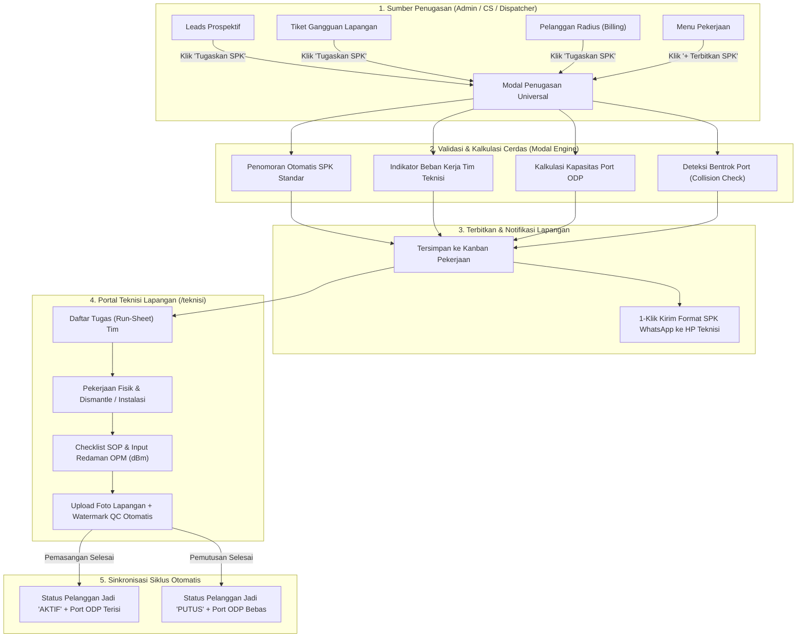

# Tutorial Lengkap Sistem Penugasan Teknisi & SPK (Nexus Net)

Berikut adalah panduan komprehensif penggunaan fitur **Sistem Penugasan Teknisi & Surat Perintah Kerja (SPK)** terpadu di Nexus Net Management. Fitur ini memungkinkan dispatching pekerjaan teknisi lintas modul secara instan, otomatisasi nomor SPK, pencegahan tabrakan port ODP, pengiriman format WhatsApp 1-klik, hingga kontrol mutu (QC) hasil lapangan teknisi.

---

## 📹 Video Rekaman Interaktif (Screen Recording)

Tonton demonstrasi visual alur kerja penugasan teknisi berikut ini (mulai dari penerbitan SPK di Leads, Gangguan, Pelanggan Radius, pemantauan Kanban Pekerjaan, hingga penyelesaian di Dashboard Teknisi):


---

## 🧭 Diagram Alur Kerja (Workflow Diagram)



---

## 1. Cara Menerbitkan SPK dari Menu Leads (Pemasangan Baru / PSB)

Gunakan alur ini ketika calon pelanggan baru siap dipasangkan jaringan internet setelah proses survey lokasi atau simulasi kelayakan.

1. Buka menu **Leads** di sidebar navigasi kiri (`/leads`).
2. Cari kartu calon pelanggan yang berstatus **Survei** atau **Berminat**.
3. Klik tombol biru **"Tugaskan SPK"** pada kartu leads.
4. Sistem otomatis membuka jendela **"Terbitkan Surat Perintah Kerja (SPK)"** dengan data terisi:
   - **Nomor SPK**: Terbit otomatis dengan format `SPK/PSB/YYYYMMDD/XXXX`.
   - **Jenis Pekerjaan**: Otomatis terpilih `Pemasangan Baru (PSB)`.
   - **Nama Pelanggan & Alamat**: Terisi otomatis sesuai data survey leads.
5. **Pilih Tim Teknisi Lapangan**:
   - Di samping nama tim, terdapat indikator beban aktif (contoh: *Beban: 2 tugas aktif*), memudahkan pembagian tugas yang merata.
6. **Tentukan Sesi & Prioritas**:
   - Pilih Sesi Kunjungan: `Pagi (08:30 - 12:00)`, `Siang (13:00 - 15:30)`, atau `Sore (15:30 - 17:30)`.
   - Pilih Tingkat Prioritas: `Normal`, `Tinggi`, atau `Urgent`.
7. **Pilih ODP & Port Distribusi**:
   - Sistem menampilkan kapasitas ODP (contoh: *ODP 1.1 — Terpakai 6/8 port (Sisa 2)*).
   - Masukkan alokasi Port (misal: *Port 3*). Sistem akan otomatis memperingatkan jika nomor port tersebut sudah ditempati pelanggan aktif lain.
8. Klik **"Simpan & Kirim SPK WhatsApp"** untuk langsung mengirimkan teks SPK ke WhatsApp teknisi, atau klik **"Simpan Penugasan"**.

---

## 2. Cara Menerbitkan SPK dari Menu Gangguan (Perbaikan / Troubleshooting)

Gunakan alur ini ketika ada laporan insiden jaringan atau tiket kendala teknis (misal: redaman loss, kabel dropcore putus, modem rusak).

1. Buka menu **Gangguan** di sidebar navigasi kiri (`/gangguan`).
2. Pada tabel atau kartu tiket gangguan aktif, klik tombol **"Tugaskan SPK"**.
3. Modal penugasan akan otomatis terkonfigurasi:
   - **Nomor SPK**: Berawalan `SPK/RPR/YYYYMMDD/XXXX` (Repair / Perbaikan).
   - **Jenis Pekerjaan**: Otomatis tersetel ke `Perbaikan (Troubleshooting)`.
   - **Keterangan Tugas**: Otomatis merangkum jenis kendala, redaman terdeteksi, dan keluhan pelanggan.
4. Pilih tim teknisi yang berada di zona area terdekat.
5. Klik **"Simpan & Kirim SPK WhatsApp"**. Status tiket di Gangguan dan Pekerjaan akan otomatis tersinkronisasi.

---

## 3. Cara Menerbitkan SPK dari Pelanggan Radius (Pemutusan & Relokasi)

Gunakan alur ini untuk pelanggan yang berhenti berlangganan (Dismantle perangkat/kabel) atau pindah alamat (Relokasi).

1. Buka menu **Pelanggan** di sidebar navigasi kiri (`/pelanggan`).
2. Temukan data pelanggan yang dituju, lalu klik tombol **"Tugaskan SPK"**.
3. Ganti dropdown **Jenis Pekerjaan** sesuai kebutuhan:
   - Pilih **Pemutusan (Dismantle)**:
     - Nomor SPK otomatis berganti menjadi `SPK/DIS/YYYYMMDD/XXXX`.
     - Muncul kotak peringatan oranye: *Dismantle Modem ONT, penarikan kabel dropcore, dan pembebasan port ODP*.
   - Pilih **Relokasi (Pindah Alamat)**:
     - Nomor SPK otomatis berganti menjadi `SPK/REL/YYYYMMDD/XXXX`.
4. Pilih tim teknisi penanggung jawab penarikan aset.
5. Klik **"Simpan Penugasan"**.

---

## 4. Standar Penomoran & Format Pesan WhatsApp SPK

Sistem menerapkan standarisasi format penomoran resmi yang rapi:

| Jenis Tugas | Prefix Nomor SPK | Contoh Format SPK |
| :--- | :--- | :--- |
| **Pemasangan Baru** | `SPK/PSB` | `SPK/PSB/20261001/3821` |
| **Pemutusan Layanan** | `SPK/DIS` | `SPK/DIS/20261001/4912` |
| **Perbaikan / Gangguan** | `SPK/RPR` | `SPK/RPR/20261001/7104` |
| **Relokasi Alamat** | `SPK/REL` | `SPK/REL/20261001/8291` |
| **Perbaikan Khusus ODP/ODC**| `SPK/SPL` | `SPK/SPL/20261001/1053` |

### Contoh Format Pesan WhatsApp yang Dikirim ke Teknisi:
```text
🚨 *SURAT PERINTAH KERJA (SPK) - NEXUS NET*
━━━━━━━━━━━━━━━━━━━━━
📋 *No. SPK:* SPK/PSB/20261001/3821
🛠️ *Jenis Tugas:* PEMASANGAN BARU (PSB)
⚡ *Prioritas:* TINGGI
📅 *Jadwal:* 01/10/2026 (Sesi: Pagi (08:30 - 12:00))
👷 *Tim Ditugaskan:* GATRA - AIS

👤 *DATA PELANGGAN*
• Nama: Ahmad Fauzi
• Telepon/WA: 081298765432
• Alamat: Jl. Flamboyan No. 14, Blok C2

📍 *DATA TEKNIS JARINGAN*
• Titik ODP: ODP 1.1
• Alokasi Port: Port 3
• Titik Koordinat: -0.02641, 109.34211
• Navigasi Google Maps: https://maps.google.com/?q=-0.02641,109.34211

📝 *Instruksi / Catatan Khusus:*
Pastikan redaman OPM maksimal -22 dBm dan upload foto barcode ONT.
━━━━━━━━━━━━━━━━━━━━━
_Mohon konfirmasi penerimaan tugas dan laporkan hasil via Dashboard Teknisi._
```

---

## 5. Validasi Cerdas Kapasitas ODP & Pencegahan Bentrok Port

Sistem dilengkapi algoritma penjaga integritas jaringan di [src/lib/portCollision.js](file:///d:/Project/Project%20Aplikasi%20Kurnia/xnet-wifi-manager/src/lib/portCollision.js):

1. **ODP Penuh Warning**: Jika kapasitas port ODP telah terpakai 100% (contoh 8/8 port), indikator merah berkedip akan muncul di modal penugasan dan menyarankan penambahan splitter atau pindah ODP terdekat.
2. **Anti-Collision Port**: Jika teknisi/dispatcher memasukkan nomor port yang sudah digunakan oleh pelanggan lain yang statusnya masih `AKTIF`, sistem langsung menampilkan identitas pemakai port tersebut sehingga tidak ada risiko port tertukar.
3. **Pembersihan Otomatis Saat Pemutusan**: Ketika pekerjaan `PEMUTUSAN` dinyatakan **Selesai**, sistem langsung membebaskan port ODP tersebut agar kembali berstatus kosong (tersedia) untuk pelanggan baru.

---

## 6. Alur Eksekusi & QC di Dashboard Teknisi (`/teknisi`)

Saat teknisi login di HP lapangan mereka:

1. **Run-Sheet Lapangan**: Teknisi dapat melihat daftar tugas hari ini, rute kunjungan, dan instruksi SPK.
2. **One-Click Maps**: Teknisi cukup klik tombol peta untuk membuka rute Google Maps langsung ke rumah pelanggan atau tiang ODP.
3. **Selesaikan Tugas & Quality Control (QC)**:
   - Klik **"Selesaikan Tugas"**.
   - Masukkan hasil pengukuran kabel optik via **OPM (Optical Power Meter)** dalam satuan `dBm` (contoh: `-18.40 dBm`).
   - Sistem langsung memberikan penilaian mutu:
     - 🟢 **Redaman Prima (-15 s/d -22 dBm)**: Memenuhi standar tertinggi Nexus Net & berhak mendapatkan bonus insentif.
     - 🟡 **Standar (-22.01 s/d -24 dBm)**: Batas normal operasional.
     - 🔴 **Kurang Baik (< -24 dBm)**: Sistem menyarankan penyambungan ulang (splicing ulang) sebelum serah terima.
   - Pada pekerjaan **PEMUTUSAN**, pengukuran optical loss dibebaskan (*N/A*) dan digantikan checklist penarikan modem ONT serta kabel dropcore.
4. **Watermark Otomatis Foto Bukti Lapangan**:
   - Kamera atau galeri foto secara otomatis dikompresi ringan di sisi browser HP (hemat kuota) dan dicantumkan stempel watermark permanen:
     - *GPS Koordinat Presisi*
     - *Waktu Pengerjaan Real-time (WIB)*
     - *Nama Tim Teknisi & ID Pelanggan*
5. **Verifikasi Bukti**: Admin dan Dispatcher dapat membuka modal **"Bukti Lapangan"** di Kanban Pekerjaan untuk menginspeksi foto OPM, foto tiang, dan barcode modem.

---

> [!TIP]
> **Akses Cepat Pengujian**:
> - Akun Admin: `demo_admin@nexus.net` (Password: `password123`)
> - Akun Teknisi Lapangan: `gatra@nexus.net` (Password: `gatra123`)
